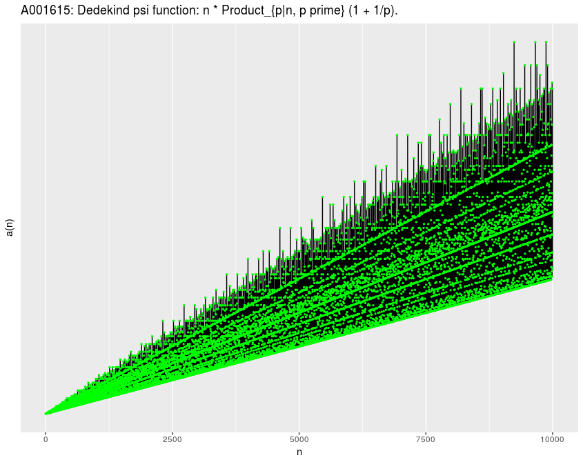

<!-- badges: start -->
[](https://github.com/EnriquePH/OEIS.R/actions/workflows/R-CMD-check.yml)
[](https://github.com/EnriquePH/OEIS.R/actions/workflows/test-coverage.yml)
[](https://codecov.io/gh/EnriquePH/OEIS.R)
[](https://opensource.org/licenses/MIT)
[](https://github.com/EnriquePH/OEIS.R/stargazers)
<!-- badges: end -->

# OEIS.R


**Access sequences from the [On-Line Encyclopedia of Integer Sequences (OEIS)](https://oeis.org/) directly from R**

OEIS is one of the world's most valuable mathematical resources: thousands of
integer sequences with formulas, comments, references, and code. It has
contributed to mathematical discoveries and is cited in over 6000 articles.
**OEIS.R** brings this data to R in a structured way, making it easy to
visualize, analyze, and use in mathematical hypotheses or contributions to OEIS.

## Installation

```r
# install.packages("devtools")  # if you don't have it
devtools::install_github("EnriquePH/OEIS.R")
```

## Quick Start

```r
Rlibrary(OEIS.R)
library(ggplot2)

# Download the Fibonacci sequence (A000045)
fib <- OEIS_sequence("A000045")

# Basic info
OEIS_description(fib)
OEIS_formula(fib)

# Quick plot (add your own image here after generating it!)
OEIS_plot(fib)
```

## Another example: Sequence A001615

```r
id <- "A001615"
x <- OEIS_sequence(id)

OEIS_ggplot(x) +
  geom_line() +
  geom_point(size = 0.5, color = "green") +
  labs(title = paste("OEIS", id, "-", OEIS_name(x)))
```



## Main Features

Download and parsing of OEIS sequences (terms, description, formula, offset, etc.).
Seamless integration with _ggplot2_ for visualization.
Helper functions:

* _OEIS_description()_
* _OEIS_formula()_
* _OEIS_keywords()_

Respects OEIS terms of use (rate limiting recommended).
Example Shiny app for interactive exploration.

## Shiny App
Try the interactive demo: OEIS.R Shiny App

## Useful Links

* [Official OEIS website](https://oeis.org/)
* [OEIS Terms of Use](https://oeis.org/OEISTermsOfUse.pdf)
* [Wikipedia: OEIS](https://en.wikipedia.org/wiki/On-Line_Encyclopedia_of_Integer_Sequences)
* [OEIS Foundation](http://oeisf.org/)

## Contributing
Contributions are welcome! Feel free to open issues or pull requests for
features like term-based search, caching, extended parsing, or vignettes.

## Author
Enrique Pérez Herrero

* GitHub: [@EnriquePH](https://github.com/EnriquePH)
* LinkedIn: [eph3000](https://www.linkedin.com/in/eph3000)

**Built with [RStudio](https://posit.co/download/rstudio-desktop/)** • Licensed under the [MIT License](LICENSE)
